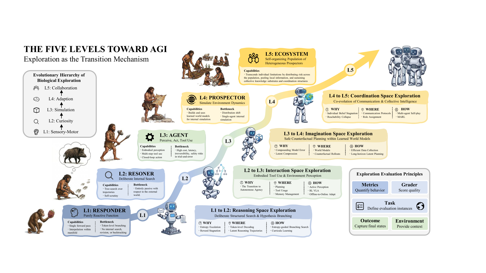
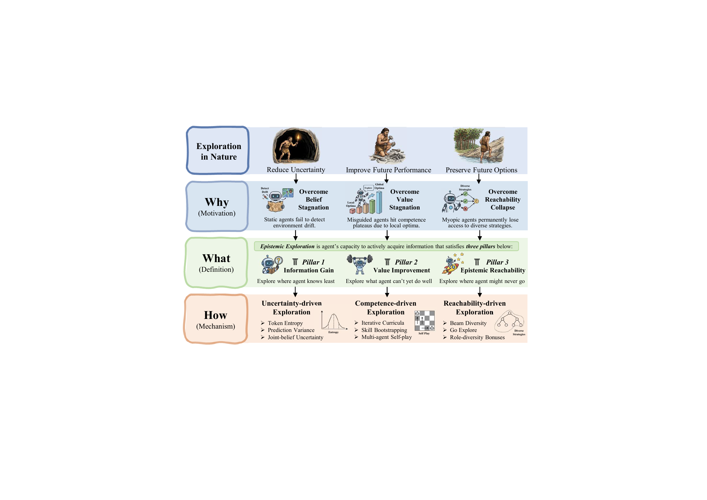
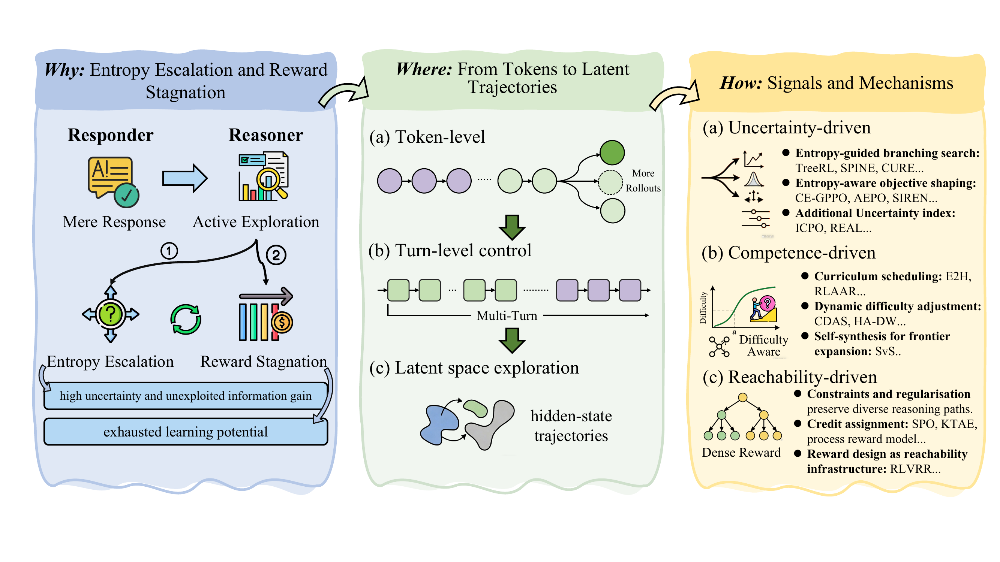
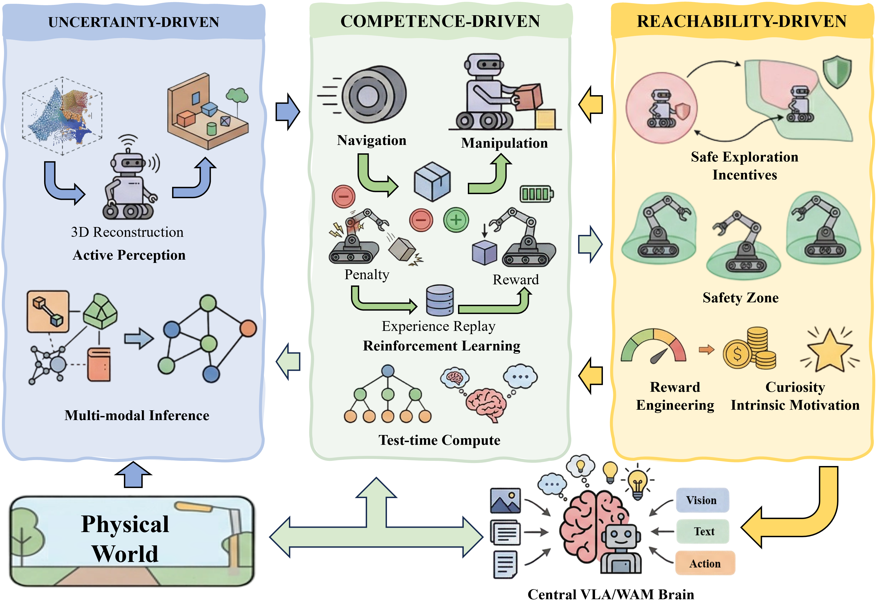
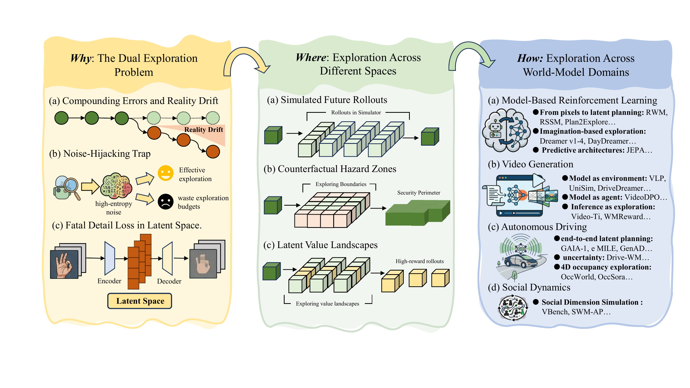
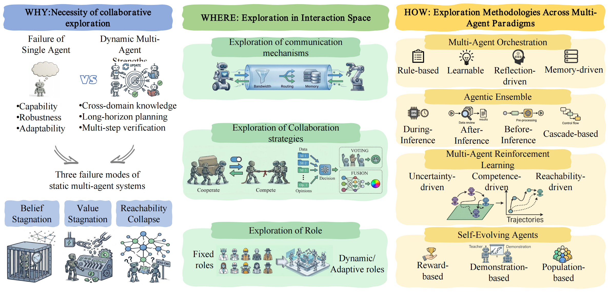

<h1 align="center">🔥 Awesome-Epistemic-Exploration

"Epistemic Exploration Toward Artificial General Intelligence"  (ArXiv 2026) </h2>


<p align="center">
  <b>◇ Responder → Reasoner → Agent → Prospector → Ecosystem ◇</b>
    <br>
   <i><b>🚀 Exploration as the Transition Mechanism 🚀</b></i>
</p>

<p align="center"></p>


<p align="center">
  <!-- <a href="#"></a> -->
  <!-- <a href="#"></a> -->
  <a href="https://github.com/banyikun/epistemic_exploration"></a>
  <a href="#"></a>
  <a href="#"></a>
  <a href="#"></a>
  </a>
  <a href=""></a>
</p>

<p align="center">
  <a href="https://github.com/banyikun/epistemic_exploration/stargazers"></a>
  <a href="https://github.com/banyikun/epistemic_exploration/network/members"></a>
</p>

<h4 align="center">If you find our survey helpful, please give it a star ⭐ to show your support！Thank you:)

</h4>


---

## 📣 Notices

> 🔥 This is a curated paper list for the survey **"Epistemic Exploration Toward Artificial General Intelligence"**, covering exploration mechanisms across reasoning, embodied AI, world models, and multi-agent systems.

> 🔥 **Stay tuned for our full paper release, incorporating the latest developments.**

> **[Always] [Add your papers]** We welcome all related papers! If you find any missed or new work, please open a Pull Request or contact us.

> **[Always] [Maintain]** We will keep this list updated frequently!

---


<br>


## 📑 Table of Contents

- [1. Overview](#1-overview)
  - [1.1 What is Epistemic Exploration?](#11-what-is-epistemic-exploration)
  - [1.2 Three Criteria](#12-three-criteria)
  - [1.3 Five-Level Trajectory Toward AGI](#13-five-level-trajectory-toward-agi)
  - [1.4 3×5 Taxonomy](#14-3×5-taxonomy)
- [2. Level 1–2: Responder → Reasoner (Reasoning-Space Exploration)](#2-levels-12-responder--reasoner--reasoning-space-exploration)
  - [2.1 Uncertainty-Driven Exploration](#21-uncertainty-driven-exploration)
  - [2.2 Competence-Driven Exploration](#22-competence-driven-exploration)
  - [2.3 Reachability-Driven Exploration](#23-reachability-driven-exploration)
- [3. Level 3: Reasoner → Agent (Perception- & Action-Space Exploration)](#3-level-3-reasoner--agent--perception--action-space-exploration)
  - [3.1 Digital Agents](#31-digital-agents)
    - [3.1.1 Uncertainty-Driven Exploration](#311-uncertainty-driven-exploration)
    - [3.1.2 Competence-Driven Exploration](#312-competence-driven-exploration)
    - [3.1.3 Reachability-Driven Exploration](#313-reachability-driven-exploration)
  - [3.2 Embodied Agents](#32-embodied-agents)
- [4. Level 4: Agent → Prospector (Imagination-Space Exploration)](#4-level-4-agent--prospector--imagination-space-exploration)
- [5. Level 5: Prospector → Ecosystem (Coordination-Space Exploration)](#5-level-5-prospector--ecosystem--coordination-space-exploration)
- [6. Cross-Cutting Topics](#6-cross-cutting-topics)
- [7. Citation](#7-citation)

---


## 1. Overview

### 1.1 What is Epistemic Exploration?

> **Epistemic exploration** is the agent's capacity to actively acquire information that reduces its uncertainty about the world, convert that reduction into durable policy improvement, and keep future acquisition possible.

Unlike undirected exploration (e.g., ε-greedy), epistemic exploration is *intentional*, *belief-driven*, and *multi-scale*: the agent reasons about which actions are most informative and plans multi-step information-gathering strategies across reasoning trajectories, tool-use policies, embodied sensorimotor loops, world-model rollouts, and multi-agent coordination protocols.

### 1.2 Three Criteria

<p align="center"></p>
<p align="center"><i>Figure: Foundation of Epistemic Exploration — Why, What, and How.</i></p>

We ground epistemic exploration in **three jointly necessary criteria**, each addressing a distinct failure mode of static optimisation:

| Criterion | What It Does | Failure Mode Addressed | Explores... |
|:---------:|:-------------|:-----------------------|:------------|
| **C1: Information Gain** | Actively reduces epistemic uncertainty via belief-updating observations | *Belief Stagnation* — frozen internal model under distribution shift | ...where it knows least |
| **C2: Value Improvement** | Converts new information into durable policy improvement | *Value Stagnation* — local optima lock-in, surrogate misalignment | ...what it cannot yet do well |
| **C3: Epistemic Reachability** | Preserves positive visitation over belief-consistent regions | *Reachability Collapse* — irreversible contraction of behavioural diversity | ...where it might otherwise never go |

These form a closed loop: **gain information → convert to value → keep the capacity to gain information alive → ...**

### 1.3 Five-Level Trajectory Toward AGI

We propose exploration as the **transition mechanism** between five levels of increasing agent sophistication. Each level introduces a qualitatively new exploration space that the previous level cannot access:

| Transition | Exploration Space | What Becomes Explorable |
|:-----------|:------------------|:------------------------|
| **L1→L2: Responder → Reasoner** | **Reasoning space** | Hypotheses, reasoning trajectories, latent thought representations |
| **L2→L3: Reasoner → Agent** | **Perception & action space** | Tool invocation, sensorimotor loops, memory management |
| **L3→L4: Agent → Prospector** | **Imagination space** | Counterfactual futures in learned world models, dual real-imagined exploration |
| **L4→L5: Prospector → Ecosystem** | **Coordination space** | Communication topologies, role assignments, shared world models |

### 1.4 3×5 Taxonomy

Our survey is organized as a **3×5 taxonomy** crossing three signal-driven methodologies with the five levels:

|  | **L1 Responder** | **L2 Reasoner** | **L3 Agent** | **L4 Prospector** | **L5 Ecosystem** |
|:-|:---|:---|:---|:---|:---|
| **Uncertainty-Driven** | Token entropy | Ensemble disagreement, semantic uncertainty | Active SLAM, prediction variance | Epistemic disagreement in latent space | Joint-belief uncertainty |
| **Competence-Driven** | Input difficulty | Iterative curricula, self-play | Skill bootstrapping, RL-VLA | Imagination-based skill discovery | Multi-agent self-play curricula |
| **Reachability-Driven** | Anti-repetition | Beam diversity, reasoning-path anti-foreclosure | Go-Explore, coverage curricula | Latent-space diversity bonuses | Role-diversity, anti-specialisation |

---

<br>

## 2. Levels 1–2: Responder → Reasoner — Reasoning-Space Exploration

The transition from **Responder** to **Reasoner** requires exploration in *reasoning space*: branching over token sequences, reasoning trajectories, and latent thought representations. The agent must search for informative hypotheses rather than simply produce reactive outputs.

<p align="center"></p>
<p align="center"><i>Figure: Levels 1–2 Reasoning-Space Exploration — Why (entropy escalation & reward stagnation), Where (tokens → turns → latent trajectories), and How (uncertainty / competence / reachability-driven).</i></p>

### 2.1 Uncertainty-Driven Exploration

Methods that prioritise exploration at high-uncertainty branching points in the reasoning process:

| Method | Strategy | Paper |
|:-------|:---------|:------|
| **CURE** | High-entropy tokens as re-branching anchors | Uncertainty-aware Reasoning Enhancement (2025) |
| **SPINE** | Concentrates updates on high-entropy branching points | Sparse Inference with Entropy (2025) |
| **TreeRL** | On-policy tree search from high-entropy steps | Tree-Structured RL for Reasoning (2025) |
| **CE-GPPO** | Coordinating entropy-gradient preservation | CE-GPPO (2025) |
| **SIREN** | Top-p & peak-entropy masks for meaningful exploration | Rethinking Entropy in LLM Reasoning (2025) |
| **AEPO** | Anchors entropy to user-specified target level | Arbitrary Entropy Policy Optimization (2025) |
| **ICPO** | Intrinsic confidence from relative generation probabilities | Intrinsic Confidence Policy Optimization (2025) |
| **REAL** | Categorical labels replacing scalar rewards | Rewards as Labels (2026) |

### 2.2 Competence-Driven Exploration

Methods that match problem difficulty to the model's evolving competence frontier:

| Method | Strategy | Paper |
|:-------|:---------|:------|
| **E2H** | Easy-to-hard curriculum with gradual fade-out | Easy to Hard Curriculum (2025) |
| **RLAAR** | Ability-gated curriculum with abstention reward | RL with Abstention-Aware Rewards (2025) |
| **Online Difficulty Filtering** | Selects medium-difficulty samples by current success rate | Dynamic Difficulty Filtering (2025) |
| **CDAS** | Historical performance gaps for robust difficulty estimation | Competence-Driven Adaptive Sampling (2025) |
| **HA-DW** | Tracks evolving competence, reweights difficulty | Hardness-Aware Dynamic Weighting (2026) |
| **SvS** | Self-synthesized harder variants from solved examples | Solve via Self-play (2025) |
| **Absolute Zero** | Reinforced self-play with zero external data | Absolute Zero Reasoner (2025) |

### 2.3 Reachability-Driven Exploration

Methods that prevent irreversible contraction of reasoning trajectory distributions:

| Method | Strategy | Paper |
|:-------|:---------|:------|
| **Trust-region methods** | KL penalties, PPO clipping to preserve pre-trained breadth | Various (2025) |
| **Anti-degeneration penalties** | Repetition penalties, length-budget constraints | Welleck et al. (2020), various (2025) |
| **SPO / KTAE** | Step-level credit assignment preserving alternative trajectories | Step Policy Optimization / KTAE (2025) |
| **VRPRM** | Process-level dense supervision for intermediate steps | Verifiable Reward PRM (2025) |
| **RLVRR** | Content coverage + style constraints for denser rewards | RL with Verifiable & Reward-Rich feedback (2026) |

---

<br>

## 3. Level 3: Reasoner → Agent — Perception- & Action-Space Exploration

At Level 3, the agent crosses from internal reasoning into **situated interaction with external environments**. Exploration unfolds in perception and action space, where every step incurs real cost.

### 3.1 Digital Agents

Agents operating in software-mediated environments (web, APIs, code interpreters):

#### 3.1.1 Uncertainty-Driven Exploration

Methods that acquire information under partial observability by prioritising uncertain states, tool calls, or capability boundaries:

| Date | Method | Key Idea | Paper | Github |
|:---:|:-------|:---------|:------|:---:|
| 2026-01 | **JitRL** | Uses count-based uncertainty bonuses to explore unseen state-action pairs | [Just-In-Time Reinforcement Learning: Continual Learning in LLM Agents Without Gradient Updates](https://arxiv.org/abs/2601.18510) | [](https://github.com/liushiliushi/JitRL) |
| 2023-05 | **RAP** | Explores alternative reasoning paths with MCTS and UCB guidance | [Reasoning with Language Model is Planning with World Model](https://doi.org/10.18653/v1/2023.emnlp-main.507) | [](https://github.com/Ber666/RAP) |
| 2024-08 | **Agent Q** | Expands high-value action trajectories via MCTS-guided exploration | [Agent Q: Advanced Reasoning and Learning for Autonomous AI Agents](https://arxiv.org/abs/2408.07199) | - |
| 2023-10 | **LAST** | Explores reasoning-action branches through language-agent tree search | [Language Agent Tree Search Unifies Reasoning Acting and Planning in Language Models](https://arxiv.org/abs/2310.04406) | [](https://github.com/lapisrocks/LanguageAgentTreeSearch) |
| 2025-04 | **KnowSelf** | Explores capability boundaries by detecting uncertain self-knowledge | [Agentic Knowledgeable Self-awareness](https://arxiv.org/abs/2504.03553) | [](https://github.com/zjunlp/KnowSelf) |
| 2025-01 | **Search-o1** | Explores external evidence when reasoning exposes knowledge uncertainty | [Search-o1: Agentic Search-Enhanced Large Reasoning Models](https://doi.org/10.18653/v1/2025.emnlp-main.276) | [](https://github.com/RUC-NLPIR/Search-o1) |

#### 3.1.2 Competence-Driven Exploration

Methods that tame combinatorial tool-use spaces through curricula, process-level credit assignment, and self-generated training tasks:

| Date | Method | Key Idea | Paper | Github |
|:---:|:-------|:---------|:------|:---:|
| 2025-08 | **PilotRL** | Stages curricula to expand agent exploration from planning to tool use | [PilotRL: Training Language Model Agents via Global Planning-Guided Progressive Reinforcement Learning](https://arxiv.org/abs/2508.00344) | - |
| 2025-09 | **ReSum-GRPO** | Sustains long-horizon search exploration through context summarization | [ReSum: Unlocking Long-Horizon Search Intelligence via Context Summarization](https://arxiv.org/abs/2509.13313) | - |
| 2024-03 | **ETO** | Optimizes exploratory trial-and-error trajectories for agent learning | [Trial and Error: Exploration-Based Trajectory Optimization for LLM Agents](https://arxiv.org/abs/2403.02502) | [](https://github.com/Yifan-Song793/ETO) |
| 2025-09 | **Planner-R1** | Uses dense process rewards to steer exploration toward feasible plans | [Planner-R1: Reward Shaping Enables Efficient Agentic RL with Smaller LLMs](https://arxiv.org/abs/2509.25779) | - |
| 2025-08 | **RLTR** | Rewards complete tool-use processes to improve exploratory planning | [Encouraging Good Processes Without the Need for Good Answers: Reinforcement Learning for LLM Agent Planning](https://arxiv.org/abs/2508.19598) | - |
| 2025-05 | **GiGPO** | Assigns state-level credit across grouped rollouts for exploration | [Group-in-Group Policy Optimization for LLM Agent Training](https://arxiv.org/abs/2505.10978) | [](https://github.com/langfengQ/verl-agent) |
| 2025-11 | **Agent0-VL** | Evolves tool-integrated exploration through repeated reasoning cycles | [Agent0-VL: Exploring Self-Evolving Agent for Tool-Integrated Vision-Language Reasoning](https://arxiv.org/abs/2511.19900) | [](https://github.com/aiming-lab/Agent0) |
| 2025-05 | **Absolute Zero** | Uses proposer-solver self-play to explore new reasoning tasks | [Absolute Zero: Reinforced Self-play Reasoning with Zero Data](https://arxiv.org/abs/2505.03335) | [](https://github.com/LeapLabTHU/Absolute-Zero-Reasoner) |

#### 3.1.3 Reachability-Driven Exploration

Methods that preserve behavioural flexibility by regulating entropy or injecting useful off-policy experience:

| Date | Method | Key Idea | Paper | Github |
|:---:|:-------|:---------|:------|:---:|
| 2025-08 | **EGPO** | Adds entropy bonuses to encourage exploration in function-call reasoning | [Reasoning through Exploration: A Reinforcement Learning Framework for Robust Function Calling](https://arxiv.org/abs/2508.05118) | [](https://github.com/BingguangHao/RLFC) |
| 2025-09 | **EPO** | Regularizes entropy to sustain exploration in multi-turn agent RL | [EPO: Entropy-regularized Policy Optimization for LLM Agents Reinforcement Learning](https://arxiv.org/abs/2509.22576) | [](https://github.com/WujiangXu/EPO) |
| 2025-09 | **ENTROPO** | Uses entropy-enhanced preferences to diversify coding-agent exploration | [Building Coding Agents via Entropy-Enhanced Multi-Turn Preference Optimization](https://arxiv.org/abs/2509.12434) | - |
| 2026-03 | **RAPO** | Expands policy exploration with retrieval-augmented experience | [RAPO: Expanding Exploration for LLM Agents via Retrieval-Augmented Policy Optimization](https://arxiv.org/abs/2603.03078) | - |
| 2026-04 | **E³-TIR** | Branches from high-entropy prefixes to exploit exploratory experience | [E3-TIR: Enhanced Experience Exploitation for Tool-Integrated Reasoning](https://arxiv.org/abs/2604.09455) | [](https://github.com/yuki-younai/E3-TIR) |

### 3.2 Embodied Agents

<p align="center"></p>
<p align="center"><i>Figure: Level 3 Embodied Agent Exploration — Uncertainty-driven active perception, competence-driven RL & test-time compute, and reachability-driven safety & reward engineering.</i></p>

Agents operating in physical/simulated environments with continuous action spaces:

| Paradigm | Method | Key Idea | Project |
|:---------|:-------|:---------|:--------|
| **Uncertainty-Driven** | | | |
| *Geometric & high-fidelity reconstruction* | [ActiveSplat](https://arxiv.org/abs/2410.21955) | Gaussian splatting for information-maximizing viewpoint selection | [🔗](https://github.com/Li-Yuetao/ActiveSplat) |
| | [APT](https://arxiv.org/abs/2103.04551) | Unsupervised active pre-training with every transition | [🔗](https://github.com/rll-research/url_benchmark) |
| | [MAX](https://arxiv.org/abs/1810.12162) | Model-based active exploration via ensemble disagreement | [🔗](https://github.com/nnaisense/MAX) |
| | [Active Neural SLAM](https://arxiv.org/abs/2004.05155) | Learning to explore using active neural SLAM | [🔗](https://github.com/devendrachaplot/Neural-SLAM) |
| *Semantic active inference* | [Conan](https://arxiv.org/abs/2311.02018) | Active reasoning in open-world environments | [🔗](https://github.com/ariesssxu/Conan-Active-Reasoning) |
| | [ActiveRIR](https://arxiv.org/abs/2404.16216) | Cross-modal audio-visual exploration | - |
| | [Active Semantic Perception](https://arxiv.org/abs/2510.05430) | Active semantic perception for embodied agents | [🔗](https://github.com/grasp-lyrl/active_semantic_perception) |
| *Active mapping & path planning* | [Fisher-info planning](https://arxiv.org/abs/2410.17422) | MLLM-guided exploration via Fisher information | [🔗](https://github.com/JiangWenPL/multimodal-active) |
| **Objective-Driven** | | | |
| *Language-guided navigation* | [SayCan](https://arxiv.org/abs/2204.01691) | Grounding language in robotic affordances | [🔗](https://github.com/google-research/google-research/tree/master/saycan) |
| | [Inner Monologue](https://arxiv.org/abs/2207.05608) | Embodied reasoning through planning with language models | - |
| | [LM-Nav](https://arxiv.org/abs/2207.04429) | Robotic navigation with large pre-trained models | [🔗](https://github.com/blazejosinski/lm_nav) |
| | [VLMaps](https://arxiv.org/abs/2210.05714) | Visual language maps for robot navigation | [🔗](https://github.com/vlmaps/vlmaps) |
| | [LFG](https://arxiv.org/abs/2310.10103) | Semantic guesswork as a heuristic for planning | [🔗](https://github.com/Michael-Equi/lfg-nav) |
| **Competence-Driven** | | | |
| *Offline RL-VLA* | [Q-Transformer](https://arxiv.org/abs/2309.10150) | Scale value learning to static trajectories | - |
| | [Cal-QL](https://arxiv.org/abs/2303.05479) | Calibrated offline RL for robot manipulation | - |
| *Online RL-VLA* | [VLA-RL](https://arxiv.org/abs/2505.18719) | PPO-based online RL for VLA | [🔗](https://github.com/GuanxingLu/vlarl) |
| | [FLaRe](https://arxiv.org/abs/2409.16578) | Fine-tuning language models for autonomous RL | [🔗](https://github.com/JiahengHu/FLaRe) |
| | [SimpleVLA-RL](https://arxiv.org/abs/2509.09674) | GRPO-based online RL for VLA | [🔗](https://github.com/PRIME-RL/SimpleVLA-RL) |
| | [SOP](https://arxiv.org/abs/2601.03044) | Scalable online post-training for VLA | - |
| *Hybrid (Offline+Online)* | [ConRFT](https://arxiv.org/abs/2502.05450) | Offline-to-online with Cal-QL + BC | [🔗](https://github.com/cccedric/conrft) |
| | [SRPO](https://arxiv.org/abs/2511.15605) | Self-refined policy optimization | [🔗](https://github.com/SUSTechBruce/SRPO_MLLMs) |
| | [Dual-Actor FT](https://arxiv.org/abs/2509.13774) | Dual-actor fine-tuning for offline-to-online | - |
| *Test-time compute & cognitive search* | [VLA-Reasoner](https://arxiv.org/abs/2509.22643) | MCTS-based planning for VLA | - |
| | [DeepThinkVLA](https://arxiv.org/abs/2511.15669) | Slow-thinking VLA via GRPO | [🔗](https://github.com/OpenBMB/DeepThinkVLA) |
| | [Hume](https://arxiv.org/abs/2505.21432) | System-2 thinking for embodied agents | [🔗](https://github.com/hume-vla/hume) |
| | [TT-VLA](https://arxiv.org/abs/2601.06748) | On-the-fly VLA adaptation at test-time | - |
| | [TACO](https://arxiv.org/abs/2512.02834) | Steering VLA via anti-exploration | [🔗](https://github.com/breez3young/TACO) |
| **Reachability-Driven** | | | |
| *Automated reward engineering* | [Eureka](https://arxiv.org/abs/2310.12931) | LLM-driven reward code synthesis | [🔗](https://github.com/eureka-research/eureka) |
| | [Language to Rewards](https://arxiv.org/abs/2306.08647) | Language-conditioned robotic reward synthesis | [🔗](https://github.com/google-deepmind/language_to_reward_2023) |
| | [TeViR](https://arxiv.org/abs/2505.19769) | Text-to-video reward for efficient RL | - |
| *Curiosity & curriculum* | [RND](https://arxiv.org/abs/1810.12894) | Exploration by random network distillation | [🔗](https://github.com/openai/random-network-distillation) |
| | [CurricuLLM](https://arxiv.org/abs/2409.18382) | Automatic task curricula via LLMs | [🔗](https://github.com/labicon/CurricuLLM) |
| *Constrained safety* | [Recovery RL](https://arxiv.org/abs/2010.15920) | Safe RL with learned recovery zones | [🔗](https://github.com/abalakrishna123/recovery-rl) |
| | [RECOVER](https://arxiv.org/abs/2404.00756) | Neuro-symbolic failure detection and recovery | - |
| | [SafeVLA](https://arxiv.org/abs/2503.03480) | Safe VLA with constrained policy optimization | [🔗](https://github.com/PKU-Alignment/SafeVLA) |

---

<br>

## 4. Level 4: Agent → Prospector — Imagination-Space Exploration

<p align="center"></p>
<p align="center"><i>Figure: Level 4 Imagination-Space Exploration — Why (the dual exploration problem), Where (simulated rollouts, hazard zones, latent value landscapes), and How (MBRL, video generation, autonomous driving, social dynamics).</i></p>

The Prospector internalises a **world model** and faces a **dual exploration problem**: simultaneously gathering real data to refine the model AND searching imagined trajectories to extract policies.

| Challenge | Description | Key Methods |
|:----------|:------------|:------------|
| **Compounding Errors** | Single-step prediction errors accumulate exponentially over imagined horizons | MBPO, PETS, Dreamer v4 |
| **Noise-Hijacking Trap** | Curiosity wasted on irreducible stochasticity (noisy-TV problem) | RND, RIDES, learning-progress monitoring |
| **Fatal Detail Loss** | Safety-critical information lost in latent compression | Structured latent representations, 4D sparse voxels |

**Core World Model Families:**

| Method | Key Contribution |
|:-------|:-----------------|
| **Dreamer v1/v2/v3/v4** | Progressive imagination-based skill discovery in learned latent spaces |
| **DayDreamer** | Transfers imagination-based paradigm to physical robots |
| **PETS** | Ensemble-based disentanglement of aleatoric vs. epistemic uncertainty |
| **Plan2Explore** | Task-agnostic exploration via maximizing future ensemble disagreement |
| **MuZero** | Learned dynamics model with MCTS for planning |
| **iVideoGPT** | Interactive video generation as scalable world models |
| **World-Env / WMPO** | Internal simulators for safe GRPO/PPO updates in VLA |

---

<br>

## 5. Level 5: Prospector → Ecosystem — Coordination-Space Exploration

<p align="center"></p>
<p align="center"><i>Figure: Level 5 Coordination-Space Exploration — Why (single-agent limitations), Where (communication, collaboration, role, deployment), and How (orchestration, ensemble, MARL, self-evolving agents).</i></p>

At the highest level, exploration enters **coordination space**: heterogeneous agents discover communication topologies, role specialisations, shared representations, and collaborative strategies.

| Challenge | Description |
|:----------|:------------|
| **Scalable Coordination Exploration** | The search space is combinatorial, hierarchical, and dynamic—which agents to activate, what communication to establish, how information flows |
| **Ecosystem-Level Credit Assignment** | Disentangling behavioural contribution from structural contribution under sparse, delayed feedback |
| **Diversity vs. Convergence Tension** | Balancing ecological diversity against system-level coherence |
| **Role–Communication Co-evolution** | Jointly evolving functional specialisation and information exchange protocols |

**Key Systems & Methods:**

| Method | Key Contribution |
|:-------|:-----------------|
| **MetaGPT** | Structured multi-agent coordination with role-based workflows |
| **AutoGen** | Flexible conversational multi-agent framework |
| **CAMEL** | Communicative agents for mind exploration |
| **Multi-agent Debate** | Structured deliberation improving collective reasoning (Du et al.) |
| **Learnable orchestration** | RL-evolved coordination topologies, optimisable agent graphs |


### 5.2 Agentic Ensemble Papers


#### 5.2.1 Ensemble-During-Inference Papers


| Date | Name | Title | Paper | Github |
|:---:|:---:|---|:---:|:---:|
| 2025-10 | `SAFE` | When to Ensemble: Identifying Token-Level Points for Stable and Fast LLM Ensembling | [](https://arxiv.org/pdf/2510.15346) | - |
| 2025-10 | `CoRe` | Harnessing Consistency for Robust Test-Time LLM Ensemble | [](https://www.arxiv.org/abs/2510.13855) | - |
| 2025-05 | `Transformer Copilot` | Transformer Copilot: Learning from The Mistake Log in LLM Fine-tuning | [](https://arxiv.org/abs/2505.16270) | [](https://github.com/jiaruzouu/TransformerCopilot) |
| 2025-02 | `ABE` | Token-level Ensembling of Models with Different Vocabularies | [](https://arxiv.org/abs/2502.21265) | [](https://github.com/mjpost/abe) |
| 2025-02 | `CITER` | CITER: Collaborative Inference for Efficient Large Language Model Decoding with Token-Level Routing | [](https://arxiv.org/abs/2502.01976) | [](https://github.com/aiming-lab/CITER) |
| 2025-02 | `Speculative Ensemble` | Speculative Ensemble: Fast Large Language Model Ensemble via Speculation | [](https://arxiv.org/abs/2502.01662) | [](https://github.com/Kamichanw/Speculative-Ensemble/) |
| 2024-10 | `UniTe` | Determine-Then-Ensemble: Necessity of Top-k Union for Large Language Model Ensembling | [](https://arxiv.org/abs/2410.03777) | - |
| 2024-06 | `GaC` | Breaking the Ceiling of the LLM Community by Treating Token Generation as a Classification for Ensembling | [](https://arxiv.org/abs/2406.12585) | [](https://github.com/yaoching0/GaC) |
| 2024-04 | `DeePEn` | Ensemble Learning for Heterogeneous Large Language Models with Deep Parallel Collaboration | [](https://arxiv.org/abs/2404.12715) | [](https://github.com/OrangeInSouth/DeePEn) |
| 2024-04 | `PackLLM` | Pack of LLMs: Model Fusion at Test-Time via Perplexity Optimization | [](https://arxiv.org/abs/2404.11531) | [](https://github.com/cmavro/PackLLM) |
| 2024-04 | `EVA` | Bridging the Gap between Different Vocabularies for LLM Ensemble | [](https://arxiv.org/abs/2404.09492) | [](https://github.com/xydaytoy/EVA) |
| 2024-02 | `-` | Purifying large language models by ensembling a small language model | [](https://arxiv.org/abs/2402.14845) | - |


| Date | Name | Title | Paper | Github |
|:---:|:---:|---|:---:|:---:|
| 2025-06 | `RLAE` | RLAE: Reinforcement Learning-Assisted Ensemble for LLMs | [](https://arxiv.org/abs/2506.00439) | - |
| 2024-12 | `SpecFuse` | SpecFuse: Ensembling Large Language Models via Next-Segment Prediction | [](https://arxiv.org/abs/2412.07380) | - |
| 2024-09 | `SweetSpan` | Hit the Sweet Spot! Span-Level Ensemble for Large Language Models | [](https://arxiv.org/abs/2409.18583) | - |
| 2024-07 | `Cool-Fusion` | Cool-Fusion: Fuse Large Language Models without Training | [](https://arxiv.org/abs/2407.19807) | - |


| Date | Name | Title | Paper | Github |
|:---:|:---:|---|:---:|:---:|
| 2025-11 | `CBS` | Collaborative Beam Search: Enhancing LLM Reasoning via Collective Consensus | [](https://aclanthology.org/2025.emnlp-main.574/) | - |
| 2024-12 | `LE-MCTS` | Ensembling Large Language Models with Process Reward-Guided Tree Search for Better Complex Reasoning | [](https://arxiv.org/abs/2412.15797) | - |


#### 5.2.2  Ensemble-After-Inference Papers


| Date | Name | Title | Paper | Github |
|:---:|:---:|---|:---:|:---:|
| 2025-12 | `LLM-PeerReview` | Scoring, Reasoning, and Selecting the Best! Ensembling Large Language Models via a Peer-Review Process | [](https://arxiv.org/abs/2512.23213) | [](https://github.com/zeyuji/LLM-PeerReview) |
| 2025-10 | `LLMartini` | LLMartini: Seamless and Interactive Leveraging of Multiple LLMs through Comparison and Composition | [](https://arxiv.org/abs/2510.19252) | - |
| 2025-10 | `-` | Beyond Consensus: Mitigating the Agreeableness Bias in LLM Judge Evaluations | [](https://arxiv.org/abs/2510.11822) | [](https://github.com/ai-cet/paper-arxiv-llm-judge-calibration) |
| 2025-10 | `OW/ISP` | Beyond Majority Voting: LLM Aggregation by Leveraging Higher-Order Information | [](https://www.arxiv.org/abs/2510.01499) | - |
| 2025-09 | `FLAME` | Explainable Fault Localization for Programming Assignments via LLM-Guided Annotation | [](https://arxiv.org/pdf/2509.25676v1) | [](https://github.com/FLAME-FL/FLAME) |
| 2025-09 | `CARGO` | CARGO: A Framework for Confidence-Aware Routing of Large Language Models | [](https://arxiv.org/abs/2509.14899) | - |
| 2025-07 | `LENS` | LENS: Learning Ensemble Confidence from Neural States for Multi-LLM Answer Integration | [](https://arxiv.org/abs/2507.23167) | - |
| 2025-05 | `EL4NER` | EL4NER: Ensemble Learning for Named Entity Recognition via Multiple Small-Parameter Large Language Models | [](https://arxiv.org/abs/2505.23038) | - |
| 2025-03 | `Symbolic-MoE` | Symbolic Mixture-of-Experts: Adaptive Skill-based Routing for Heterogeneous Reasoning | [](https://arxiv.org/abs/2503.05641) | [](https://github.com/dinobby/Symbolic-MoE/) |
| 2025-01 | `DFPE` | DFPE: A Diverse Fingerprint Ensemble for Enhancing LLM Performance | [](https://arxiv.org/abs/2501.17479) | [](https://github.com/nivgold/DFPE) |
| 2025-01 | `DMoA` | Balancing Act: Diversity and Consistency in Large Language Model Ensembles | [](https://openreview.net/pdf?id=Dl6nkKKvlX) | - |
| 2024-12 | `Smoothie` | Smoothie: Label Free Language Model Routing | [](https://arxiv.org/abs/2412.04692) | [](https://github.com/HazyResearch/smoothie) |
| 2024-10 | `LLM-Forest` | LLM-Forest: Ensemble Learning of LLMs with Graph-Augmented Prompts for Data Imputation | [](https://arxiv.org/abs/2410.21520) | [](https://github.com/Xinrui17/LLM-Forest) |
| 2024-10 | `LLM-TOPLA` | LLM-TOPLA: Efficient LLM Ensemble by Maximising Diversity | [](https://arxiv.org/abs/2410.03953) | [](https://github.com/git-disl/llm-topla) |
| 2024-10 | `MLKF` | Two Heads are Better than One: Zero-shot Cognitive Reasoning via Multi-LLM Knowledge Fusion | [](https://dl.acm.org/doi/abs/10.1145/3627673.3679744) | [](https://github.com/trueBatty/MLKF) |
| 2024-08 | `URG` | URG: A Unified Ranking and Generation Method for Ensembling Language Models | [](https://aclanthology.org/2024.findings-acl.261/) | - |
| 2024-02 | `Agent-Forest` | More Agents Is All You Need | [](https://arxiv.org/abs/2402.05120) | [](https://github.com/MoreAgentsIsAllYouNeed/AgentForest) |
| 2023-06 | `LLM-Blender` | LLM-Blender: Ensembling Large Language Models with Pairwise Ranking and Generative Fusion | [](https://arxiv.org/abs/2306.02561) | [](https://github.com/yuchenlin/LLM-Blender) |
| 2023-05 | `MoRE` | Getting MoRE out of Mixture of Language Model Reasoning Experts | [](https://arxiv.org/abs/2305.14628) | [](https://github.com/NoviScl/MoRE) |


#### 5.2.3 Ensemble-Before-Inference Papers


| Date | Name | Title | Paper | Github |
|:---:|:---:|---|:---:|:---:|
| 2025-10 | `DiSRouter` | DISROUTER: Distributed Self-Routing for LLM Selections | [](https://arxiv.org/abs/2510.19208) | - |
| 2025-10 | `WebRouter` | WebRouter: Query-specific Router via Variational Information Bottleneck for Cost-sensitive Web Agent | [](https://arxiv.org/abs/2510.11221) | - |
| 2025-10 | `LLMRank` | LLMRank: Understanding LLM Strengths for Model Routing | [](https://arxiv.org/abs/2510.01234) | - |
| 2025-06 | `TagRouter` | TAGROUTER: Learning Route to LLMs through Tags for Open-Domain Text Generation Tasks | [](https://arxiv.org/abs/2506.12473) | - |
| 2025-06 | `Router-R1` | Router-R1: Teaching LLMs Multi-Round Routing and Aggregation via Reinforcement Learning | [](https://arxiv.org/abs/2506.09033) | [](https://github.com/ulab-uiuc/Router-R1) |
| 2025-06 | `RadialRouter` | RadialRouter: Structured Representation for Efficient and Robust Large Language Models Routing | [](https://www.arxiv.org/abs/2506.03880) | - |
| 2025-05 | `Avengers` | The Avengers: A Simple Recipe for Uniting Smaller Language Models to Challenge Proprietary Giants | [](https://arxiv.org/abs/2505.19797) | [](https://github.com/ZhangYiqun018/Avengers) |
| 2025-05 | `RTR` | Route to Reason: Adaptive Routing for LLM and Reasoning Strategy Selection | [](https://arxiv.org/abs/2505.19435) | [](https://github.com/goodmanpzh/Route-To-Reason) |
| 2025-05 | `InferenceDynamics` | InferenceDynamics: Efficient Routing Across LLMs through Structured Capability and Knowledge Profiling | [](https://arxiv.org/abs/2505.16303) | - |
| 2025-05 | `-` | Rethinking Predictive Modeling for LLM Routing: When Simple kNN Beats Complex Learned Routers | [](https://arxiv.org/abs/2505.12601) | - |
| 2025 | `RELM` | Co-optimizing Recommendation and Evaluation for LLM Selection | [](https://openreview.net/pdf?id=gWi4ZcPQRl) | - |
| 2025-02 | `-` | LLM Bandit: Cost-Efficient LLM Generation via Preference-Conditioned Dynamic Routing | [](https://arxiv.org/abs/2502.02743) | - |
| 2024-12 | `PickLLM` | PickLLM: Context-Aware RL-Assisted Large Language Model Routing | [](https://arxiv.org/abs/2412.12170) | - |
| 2024-12 | `Bench-CoE` | Bench-CoE: a Framework for Collaboration of Experts from Benchmark | [](https://arxiv.org/abs/2412.04167) | [](https://github.com/ZhangXJ199/Bench-CoE) |
| 2024-10 | `GraphRouter` | GraphRouter: A Graph-based Router for LLM Selections | [](https://arxiv.org/abs/2410.03834) | [](https://github.com/ulab-uiuc/GraphRouter) |
| 2024-09 | `Eagle` | Eagle: Efficient Training-Free Router for Multi-LLM Inference | [](https://arxiv.org/abs/2409.15518) | - |
| 2024-08 | `TO-Router` | TensorOpera Router: A Multi-Model Router for Efficient LLM Inference | [](https://arxiv.org/abs/2408.12320) | - |
| 2024-08 | `SelectLLM` | SelectLLM: Query-Aware Efficient Selection Algorithm for Large Language Models | [](https://arxiv.org/abs/2408.08545) | - |
| 2024-07 | `MetaLLM` | MetaLLM: A High-performant and Cost-efficient Dynamic Framework for Wrapping LLMs | [](https://arxiv.org/abs/2407.10834) | [](https://github.com/mail-research/MetaLLM-wrapper/) |
| 2024-06 | `RouteLLM` | RouteLLM: Learning to Route LLMs with Preference Data | [](https://arxiv.org/abs/2406.18665) | [](https://github.com/lm-sys/RouteLLM) |
| 2024-06 | `HomoRouter` | Query Routing for Homogeneous Tools: An Instantiation in the RAG Scenario | [](https://arxiv.org/abs/2406.12429) | - |
| 2024-05 | `-` | Harnessing the Power of Multiple Minds: Lessons Learned from LLM Routing | [](https://arxiv.org/abs/2405.00467) | [](https://github.com/kvadityasrivatsa/llm-routing) |
| 2024-04 | `Hybrid-LLM` | Hybrid LLM: Cost-Efficient and Quality-Aware Query Routing | [](https://arxiv.org/abs/2404.14618) | [](https://github.com/m365-core/hybrid_llm_routing) |
| 2024-03 | `ETR` | An Expert is Worth One Token: Synergizing Multiple Expert LLMs as Generalist via Expert Token Routing | [](https://arxiv.org/abs/2403.16854) | [](https://github.com/zjunet/ETR) |
| 2024-01 | `Routoo` | Routoo: Learning to Route to Large Language Models Effectively | [](https://arxiv.org/abs/2401.13979) | - |
| 2024-01 | `Blending` | Blending Is All You Need: Cheaper, Better Alternative to Trillion-Parameters LLM | [](https://arxiv.org/abs/2401.02994) | - |
| 2024 | `RouterDC` | RouterDC: Query-Based Router by Dual Contrastive Learning for Assembling Large Language Models | [](https://proceedings.neurips.cc/paper_files/paper/2024/hash/7a641b8ec86162fc875fb9f6456a542f-Abstract-Conference.html) | [](https://github.com/shuhao02/RouterDC) |
| 2023-11 | `ZOOTER` | Routing to the Expert: Efficient Reward-guided Ensemble of Large Language Models | [](https://arxiv.org/abs/2311.08692) | - |
| 2023-08 | `FORC` | Fly-Swat or Cannon? Cost-Effective Language Model Choice via Meta-Modeling | [](https://arxiv.org/abs/2308.06077) | [](https://github.com/epfl-dlab/forc) |
| 2023 | `-` | LLM Routing with Benchmark Datasets | [](https://openreview.net/forum?id=k9EfAJhFZc) | - |


#### 5.2.4 Cascaded-Based Papers


| Date | Name | Title | Paper | Github |
|:---:|:---:|---|:---:|:---:|
| 2025-12 | `RoBoN` | RoBoN: Routed Online Best-of-n for Test-Time Scaling with Multiple LLMs | [](https://www.arxiv.org/abs/2512.05542) | [](https://github.com/j-geuter/RoBoN) |
| 2025-09 | `-` | Semantic Agreement Enables Efficient Open-Ended LLM Cascades | [](https://www.arxiv.org/abs/2509.21837) | - |
| 2025-04 | `EMAFusionTM` | EMAFusionTM: A Self-Optimizing System for Seamless LLM Selection and Integration | [](https://arxiv.org/abs/2504.10681) | - |
| 2025-04 | `ModelSwitch` | Do We Truly Need So Many Samples? Multi-LLM Repeated Sampling Efficiently Scales Test-Time Compute | [](https://arxiv.org/abs/2504.00762) | [](https://github.com/JianhaoChen-nju/ModelSwitch) |
| 2024-12 | `DER` | Dynamic Ensemble Reasoning for LLM Experts | [](https://arxiv.org/abs/2412.07448) | - |
| 2024-10 | `Cascade Routing` | A Unified Approach to Routing and Cascading for LLMs | [](https://arxiv.org/abs/2410.10347) | [](https://github.com/eth-sri/cascade-routing) |
| 2024-04 | `-` | Language Model Cascades: Token-level uncertainty and beyond | [](https://arxiv.org/abs/2404.10136) | - |
| 2023-10 | `AutoMix` | AutoMix: Automatically Mixing Language Models | [](https://arxiv.org/abs/2310.12963) | [](https://github.com/automix-llm/automix) |
| 2023-10 | `neural caching` | Cache & Distil: Optimising API Calls to Large Language Models | [](https://arxiv.org/abs/2310.13561) | [](https://github.com/guillemram97/neural-caching) |
| 2023-10 | `-` | Large Language Model Cascades with Mixture of Thoughts Representations for Cost-efficient Reasoning | [](https://arxiv.org/abs/2310.03094) | [](https://github.com/MurongYue/LLM_MoT_cascade) |
| 2023-10 | `EcoAssistant` | EcoAssistant: Using LLM Assistant More Affordably and Accurately | [](https://arxiv.org/abs/2310.03046) | [](https://github.com/JieyuZ2/EcoAssistant) |
| 2023-05 | `FrugalGPT` | FrugalGPT: How to Use Large Language Models While Reducing Cost and Improving Performance | [](https://arxiv.org/abs/2305.05176) | - |
| 2023-01 | `-` | When Does Confidence-Based Cascade Deferral Suffice? | [](https://proceedings.neurips.cc/paper_files/paper/2023/hash/1f09e1ee5035a4c3fe38a5681cae5815-Abstract-Conference.html) | - |
| 2022-10 | `Model Cascading` | Model Cascading: Towards Jointly Improving Efficiency and Accuracy of NLP Systems | [](https://arxiv.org/abs/2210.05528) | - |

---

<br>


## 6. Exploration Evaluation

### Foundations
- **Three failure modes of static optimisation**: Belief Stagnation, Value Stagnation, Reachability Collapse
- **Unified Epistemic Exploration Objective**: Combines Bayes-optimal value (C2), cumulative information gain bonus (C1), and reachability constraint (C3)
- **Convergence**: As beliefs converge to truth, exploration automatically gives way to exploitation

### Biological Exploration Parallels
- **Sensory-motor embodiment** → Lévy flights, whisking, saccades
- **Intrinsic curiosity** → Dopaminergic information prediction errors
- **Meta-control** → Locus coeruleus-norepinephrine regulation
- **Cognitive simulation** → Hippocampal preplay sequences
- **Social exploration** → Swarm intelligence, Theory of Mind

### Evaluation Principles
- Benchmarks for epistemic exploration across reasoning, embodied AI, world models, and multi-agent settings
- Design principles for exploration-centric evaluation

### Open Challenges
- Open-domain scalable exploration for reasoning beyond verifiable tasks
- Safe exploration with predictive world action models
- Causal and counterfactual reasoning in imagination space
- Dynamic temporal abstraction for long-horizon planning
- Epistemic uncertainty quantification in imagination
- Scalable coordination-space exploration without combinatorial explosion

---

<br>

## 7. Citation

If you find this survey useful, please cite:

```bibtex
@article{ban2026epistemic,
  title={Epistemic Exploration Toward Artificial General Intelligence},
  author={Ban, Yikun and others},
  journal={arXiv preprint arXiv:XXXX.XXXXX},
  year={2026}
}
```

---

<p align="center">
  <i>This repository is actively maintained. If you find any errors or have new papers to suggest, please open an issue or submit a pull request!</i>
</p>
